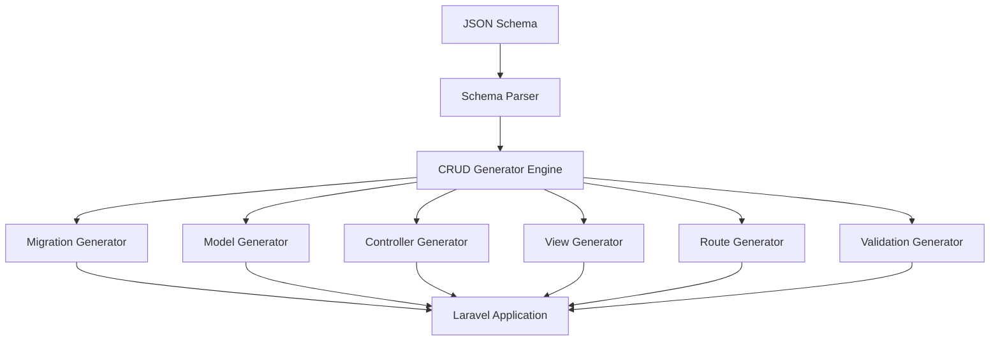
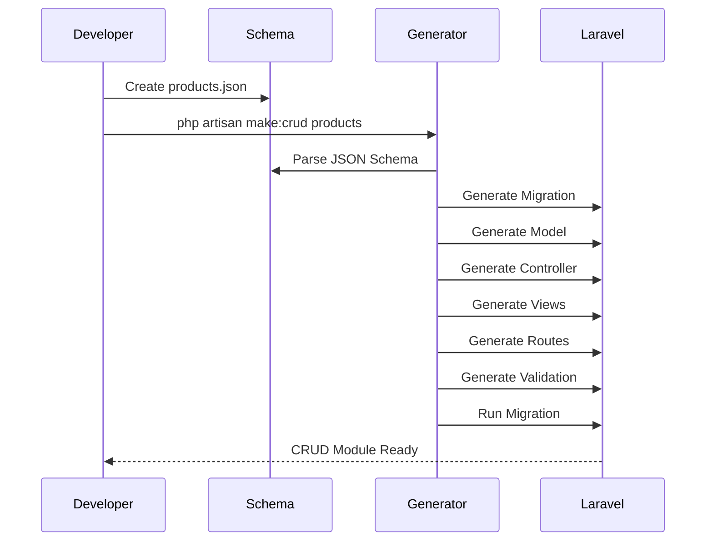
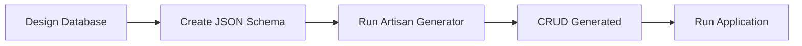

# Schema-Driven CRUD Generator for Laravel

> 🚀 **Build production-ready Laravel CRUD modules from a single JSON schema.**

**Schema-Driven CRUD Generator for Laravel** is a developer productivity tool designed to eliminate repetitive CRUD development. By defining your database structure in a simple JSON schema, the generator automatically scaffolds **Migrations**, **Eloquent Models**, **Controllers**, **Blade Views**, **Routes**, **Validation Rules**, and **KnockoutJS** components—allowing you to build consistent, maintainable, and scalable Laravel applications in minutes.

> **Define your data once. Generate everything else.**

---

## ✨ Features

- 🚀 Generate complete CRUD modules with a single Artisan command
- 📄 JSON Schema as the single source of truth
- 🏗 Generate Migration files automatically
- 📦 Generate Eloquent Models
- 🎯 Generate Resource Controllers
- 🎨 Generate Blade Views
- 🛣 Generate Web Routes
- ✅ Generate Validation Rules
- 🔄 Automatically run database migrations
- ⚡ KnockoutJS ready
- 📊 DataTables ready
- 🧩 Easily customizable through stub templates
- 📂 Clean and organized project structure

---

## 🏛 Architecture



---

## 🔄 Workflow



---

# 🚀 Getting Started

## Requirements

- PHP 8.2+
- Laravel 11
- Composer
- MySQL / MariaDB

---

## Installation

Clone the repository.

```bash
git clone https://github.com/your-username/laravel-schema-crud-generator.git
```

Install dependencies.

```bash
composer install
```

Create environment file.

```bash
cp .env.example .env
```

Generate application key.

```bash
php artisan key:generate
```

Configure your database inside `.env`.

Run initial migration.

```bash
php artisan migrate
```

---

# 📄 Create a JSON Schema

Create a schema file inside the `schemas` directory.

Example:

```json
{
  "module": "products_management",
  "table": "products",
  "primary_key": "id",
  "soft_delete": false,
  "timestamps": true,
  "auth": {
    "roles": ["admin"]
  },
  "fields": [
    {
      "name": "name",
      "type": "string",
      "length": 50,
      "required": true,
      "unique": true
    },
    {
      "name": "price",
      "type": "integer",
      "length": 20,
      "required": true,
      "unique": true
    },
    {
      "name": "stock",
      "type": "integer",
      "required": true
    },
    {
      "name": "status",
      "type": "enum",
      "values": [
        "stock",
        "instock"
      ],
      "default": "active",
      "required": true
    }
  ]
}
```

---

# ⚡ Generate CRUD

Generate an entire CRUD module using one command.

```bash
php artisan make:crud products
```

or

```bash
php artisan make:crud products --schema=schemas/products.json
```

---

# 📦 Generated Files

Running the command will automatically generate:

- Migration
- Eloquent Model
- Resource Controller
- Blade Views
- Web Routes
- Validation Rules
- Database Migration

---

# 📂 Generated Structure

```
app/
├── Http/
│   └── Controllers/
├── Models/

database/
└── migrations/

resources/
└── views/

routes/
└── web.php

schemas/
└── products.json
```

---

# 📁 Project Structure

```
app/
bootstrap/
config/
database/
resources/
routes/
schemas/
stubs/
```

---

# 💡 Development Flow



---

# 🎯 Why Schema-Driven?

Traditional Laravel CRUD development usually requires creating multiple files manually.

```text
Migration
Model
Controller
Views
Routes
Validation
```

With **Schema-Driven CRUD Generator**, you only define your schema once.

```text
JSON Schema
      │
      ▼
CRUD Generator
      │
      ▼
Production-ready CRUD Module
```

This approach significantly reduces repetitive coding while keeping your project consistent and maintainable.

---

# 🛣 Roadmap

- [x] JSON Schema Support
- [x] CRUD Generator
- [x] Migration Generator
- [x] Model Generator
- [x] Controller Generator
- [x] Blade View Generator
- [x] Route Generator
- [x] Validation Generator
- [x] KnockoutJS Integration
- [x] DataTables Integration
- [ ] API Resource Generator
- [ ] Form Request Generator
- [ ] Seeder Generator
- [ ] Factory Generator
- [ ] Relationship Generator
- [ ] Policy Generator
- [ ] Unit Testing Generator
- [ ] REST API Generator

---

# Contributing

Contributions are always welcome!

If you have ideas, improvements, or bug fixes, feel free to fork this repository and submit a Pull Request.

---

# License

This project is licensed under the **MIT License**.

---

## About the Author

**Arif Efendi** is a Full Stack Web Developer and Founder of **Kazuya Media Indonesia**, specializing in Laravel, PHP, RESTful APIs, OCR solutions, authentication systems, and developer productivity tools.

Developed with using Laravel.

- 🌐 https://www.kazuyamedia.com
- 💻 https://github.com/ariefefendi

If you find this project useful, please consider giving it a ⭐ on GitHub.
